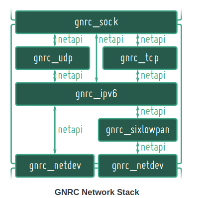
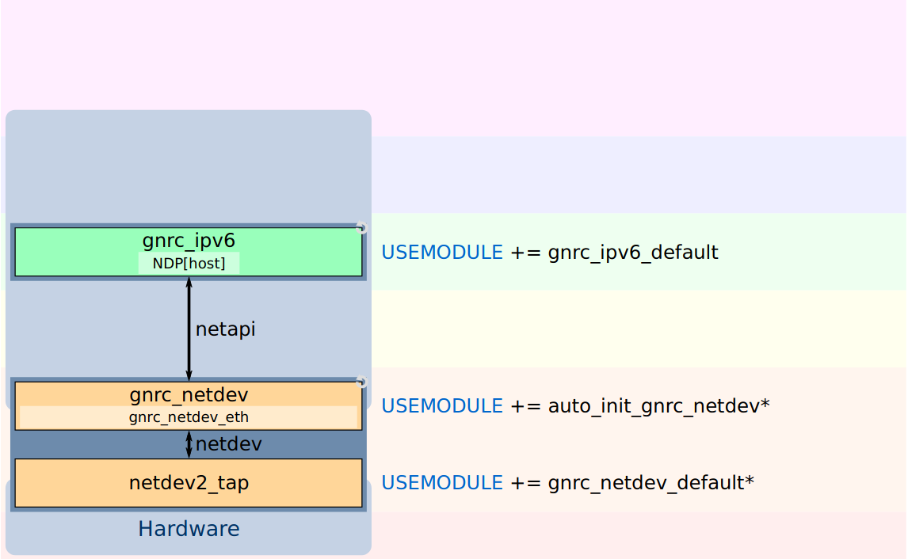
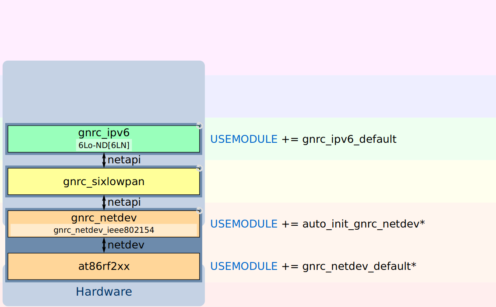
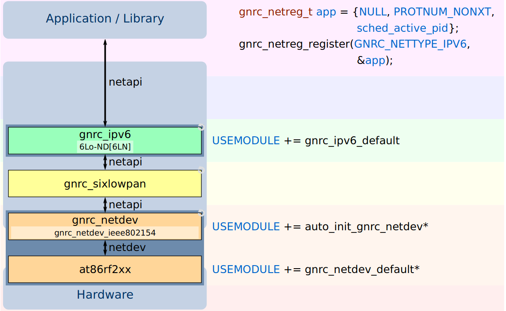

# Generic **(GNRC)** network stack

Este módulo actualmente es la pila de red predeterminada para RIOT e incluye muchos componentes que van desde una API de interfaz de red a través de una implementación IPv6 con todas las funciones con extensiones 6LowPAN a una implementación UDP y RPL.

## Integracion con RIOT
Desde la capa de aplicacionla **Generic (GNRC) network stack** puede ser accedida a traves de la **sock API**,
mientras que la **Netdev** (Network device drive API) esta definida por la **Network interface API**

## Arquitectura 




- La capa de red (Network layer) esta desacoplada del hardware a treves de **netdev API**
- La capa de aplicaciones esta desacoplada de la pila de red a traves de **sock API**
- Cada capa de la aplicacion corre en su propio hilo o thread.
- Los drivers de la radio estan implementados en ```drivers```
- La api de red **network API** esta definida en ```sys/include/net``` y esta implementada en ```sys/net```.
- Las capas mas bajas de la pila tienen las prioridades mas altas, mientras las capas mas altas tienen prioridades mas bajas.
- En este orden de ideas la implementacion de la capa **MAC** tiene la prioridad mas alta, mientras que la capa de **aplicaciones** tiene la    prioridad mas baja en toda la pila de red.

La comunicacion entre hilos o threads es manejada por el sistema de mensajeria del kernel llamada **IPC** (Inter Proccess Comunication).
En la mayoria de los casos **IPC** tendra lugar entre hilos de capas vecinas, para paquetes que atraviesan la pila de red de arriba - abajo, o viceversa.

Debido al diseno de la **GNRC** y la naturaleza del proceso de intercomunicacion, es crucial que en un nuevo modulo que introduzca un nuevo thread, siga una serie de pasos con el fin de no bloquear el sistema utilizando un ciclo infinito.

Por lo tanto, un hilo para GNRC generalmente constará de cuatro pasos básicos.

1. Inicialice una cola de mensajes 
    (tenga en cuenta que su tamaño debe ser una potencia de dos, consulte **msg_init_queue ()**)
2. registrarse para un tipo de protocolo
3. espera un mensaje
4. reaccionar adecuadamente a un mensaje y volver a 3.

```c
void *_event_loop(void *arg)
{
    static msg_t _msg_q[Q_SZ];
    (void)arg;
    msg_init_queue(_msg_q, Q_SZ);
    gnrc_netreg_entry me_reg = GNRC_NETREG_ENTRY_INIT_PID(
                                     GNRC_NETREG_DEMUX_CTX_ALL,
                                     sched_active_pid);
    gnrc_netreg_register(GNRC_NETTYPE_IPV6, &me_reg);
    while (1) {
        msg_receive(&msg);
        switch (msg.type) {
            case TYPE1:
                callback1();
                break;
            ...
        }
    }
    return NULL;
}
```

## Recibiendo y trasnmitiendo mensajes

Los paquetes pueden ser transmitidos y recibidos interactuando con la **Interface de comunicacion GNRC**

# Reciviendo paquetes
La recepcion de un paquete desde otro hilo de la aplicacion es manejado por el modulo interface de comunicacion GNRC.
Con el fin de recibir un tipo de paquete especifico, primero es necesario registrarse al tipo de protocolo.
El thread o su  hilo creado estara habilitado para recibir ciertos comandos definidos en el modulo **Interface de comunicacion GNRC** 
por ejemplo [net_gnrc_netapi::GNRC_NETAPI_MSG_TYPE_RCV)](https://doc.riot-os.org/group__net__gnrc__netapi.html#ga57b7e8cf32c12beecc9b84ca2cc073b5) para todos los paquetes para los que se registró su hilo.

# Ejemplo
El siguiente ejemplo muestra como recibir y enviar trafico UDP sobre el puerto 80

```cpp
void *_event_loop(void *arg)
{
    static msg_t _msg_q[Q_SZ];
    msg_t msg, reply;
    reply.type = GNRC_NETAPI_MSG_TYPE_ACK;
    reply.content.value = -ENOTSUP;
    msg_init_queue(_msg_q, Q_SZ);
    gnrc_pktsnip_t *pkt = NULL;
    gnrc_netreg_entry me_reg = { .demux_ctx = 80, .pid = thread_getpid() };
    gnrc_netreg_register(GNRC_NETTYPE_UDP, &me_reg);
    while (1) {
        msg_receive(&msg);
        switch (msg.type) {
            case GNRC_NETAPI_MSG_TYPE_RCV:
                pkt = msg.content.ptr;
                _handle_incoming_pkt(pkt);
                break;
            case GNRC_NETAPI_MSG_TYPE_SND:
                pkt = msg.content.ptr;
                _handle_outgoing_pkt(pkt);
                break;
             case GNRC_NETAPI_MSG_TYPE_SET:
             case GNRC_NETAPI_MSG_TYPE_GET:
                msg_reply(&msg, &reply);
                break;
            default:
                break;
        }
    }
    return NULL;
}
```

Cuando se recibe un mensaje de tipo  **GNRC_NETAPI_MSG_TYPE_SET** o **GNRC_NETAPI_MSG_TYPE_GET**, es necesario reconocerlo llamando **msg_reply()**, con un mensaje de tipo **GNRC_NETAPI_MSG_TYPE_ACK** el cual contiene el tamano actual del contenido del mensaje si la operacion tuvo exito, de lo contrario un codigo de error.
**No olvidar deregistrar con **gnrc_netreg_unregister()** si se abandona el contexto de la funcion.

## Transmitiendo paquetes
Un paquete se transmite al transmitirlo a subprocesos interesados ​​en manejar (y despachar) paquetes de su tipo. Para hacer esto, la interfaz de comunicación GNRC ofrece funciones auxiliares de despacho llamadas **gnrc_netapi_dispatch_send()** y **gnrc_netapi_dispatch_receive()**.

El siguiente fragmento de codigo muestra como se usa asumiendo un [paquete](https://doc.riot-os.org/group__net__gnrc__pkt.html) valido llamado pkt.

```cpp
gnrc_pktsnip_t *pkt;
pkt = gnrc_pktbuf_add(NULL, data, size, GNRC_NETTYPE_UNDEF);
if (pkt == NULL) {
     puts("Error: unable to copy data to packet buffer\n");
     return;
}
if (!gnrc_netapi_dispatch_send(GNRC_NETTYPE_UDP, 80, pkt)) {
     puts("Error: no thread is interested");
     gnrc_pktbuf_release(pkt);
     return;
}
```

Primero, los datos a enviar se agregan al [packet buffer](https://doc.riot-os.org/group__net__gnrc__pktbuf.html). Esto asegura su integridad durante el proceso de envío. Una vez que los datos a enviar se han agregado al búfer de paquetes, su estructura de datos principal se puede liberar o reutilizar de forma segura.

Luego, el pkt se enviará a todos los subprocesos que se registraron para **GNRC_NETTYPE_UDP** y al contexto de demux 80. Cada subproceso registrado recibirá un comando **GNRC_NETAPI_MSG_TYPE_SND** y podrá acceder al Paquete. Tenga en cuenta que en este punto, los hilos que reciben pkt actúan como sus propietarios, así que no modifique pkt después de llamar a cualquier función de envío.

Si **gnrc_netapi_dispatch_send ()** se reemplaza por **gnrc_netapi_dispatch_receive()**, los subprocesos recibirán el comando **GNRC_NETAPI_MSG_TYPE_RCV** en su lugar, nuevamente con acceso al paquete.

Nota: 
    Si los datos que se envían requieren que se agreguen encabezados adicionales para una transmisión exitosa (en el ejemplo, estos serían encabezados IP y UDP), estos deben construirse manualmente antes de llamar a **gnrc_netapi_dispatch_send ()**. En aras de la concisión, esto se omite en este tutorial; consulte [gnrc_udp_hdr_build ()](https://doc.riot-os.org/group__net__gnrc__udp.html#ga262e6ffc6333255900f79329d9e445b9), [gnrc_ipv6_hdr_build ()](https://doc.riot-os.org/group__net__gnrc__ipv6__hdr.html#gaf1cd3803edcb97066ec8b8ec19f4a2cb) etc. para obtener más información.
    GNRC se implementa de acuerdo con los estándares respectivos. Por lo tanto, tenga en cuenta que enviar a una dirección local de enlace IPv6 siempre requiere que, por definición, también proporcione la interfaz a la que desea enviar, de lo contrario, la resolución de la dirección podría fallar.


## Una vista mas detallada al stack de RIOT y su arquitectura


- Los drivers de la Radio son accesibles a traves de **netdev API** como se aprecia en la imagen.
- Todos los componentes internos usan una unica API en comun **net API**.
- la capa de aplicacion usa la **sock API**.


## Modulos de RED

- **GNRC**: Todos los  modulos de red son cargados con el modulo **gnrc_ipv6_default**.
- **lwip**: 
  - Los modulosde red IPV4 son cargados con **lwip_ipv4**
  - Los modulos de red IPV6 son cargados con **lwip_ipv6**
- Modulos de dispositivos de red
  - Drivers para **802.15.4**
  - Ethernet drivers
  - Para el uso de los drivers se debe utilizar **gnrc_netdev_default** y el modulo **auto_init_gnrc_netif**.


# La API Sock (1)

- Proporciona una abstracción común sobre cualquier stack o pila de IP.
- Tres clases de sockets son proveidos.
  - **Raw IPV4/IPV6**, **UDP** y **TCP**
- Dependiendo del stack usado, importe los modulos correctos.
- Con **GNRC** los modulos son:
  - **gnrc_sock_ip**.
  - **gnrc_sock_udp**.
  - **gnrc_sock_tcp**.
```bash
+---------------+
|  Application  |
+---------------+
        ^
        |
        v
      sock
        ^
        |
        v
+---------------+
| Network Stack |
+---------------+
```
Este modulo proporciona un set de funciones para establecer conexiones o enviar y recibir datagramas usando diferentes tipos de protocolos.
Juntos ellos sirven como una api que le permite a una aplicacion o libreria connectarse a la red.

Esto fue disenado con las siguientes prioridades en mente.

1. No hay necesidad de asignación dinamica de memoria.
2. Facilidad de uso.
3. simplicidad
4. eficiente en el front y backend.
5. Portable.

Actualmente los siguientes tipos de sockets son definidos:

```bash
    sock_ip_t (net/sock/ip.h): raw IP sock
    sock_tcp_t (net/sock/tcp.h): TCP sock
    sock_udp_t (net/sock/udp.h): UDP sock
    sock_dtls_t (net/sock/dtls.h): DTLS sock
```
Tenga en cuenta que puede que no haya relación entre los diferentes tipos de sockets. Entonces, por ejemplo un casting de ```sock_ip_t``` to ```sock_udp_t``` podría no ser tan sencillo, como cree, dependiendo de la arquitectura de red.


## Como usarlo

Una aplicación RIOT utiliza las funciones proporcionadas por uno o más de los encabezados de tipo sock por ejemplo ```sock_udp_t```, independientemente de la pila de red que use. La pila de red utilizada debajo del capó se especifica incluyendo el módulo apropiado (por ejemplo, **USEMODULE + = gnrc_sock_udp** para la versión de GNRC de esta API).

Esto permite el código agnóstico de la pila de red en la capa de aplicación. El código de la aplicación para establecer una conexión es siempre el mismo, lo que permite cambiar la pila de red debajo simplemente cambiando las definiciones de USEMODULE en el Makefile de la aplicación.

El código real depende mucho del tipo de socket utilizado. Consulte su documentación para ver ejemplos específicos.


# La API Sock (2)
- Tres diferentes tipos:
  - **sock_ip_t**, incluido en ```net/sock/ip.h```
  - **sock_udp_t**, incluido en ```net/sock/udp.h```
  - **sock_tcp_t**, incluido en ```net/sock/tcp.h```
- 4 funciones para usar la API

```bash
/* Create the sock instance */
int sock_<type>_create(sock_<type>_t *sock, const sock_<type>_ep_t *local,
                       const sock_<type>_ep_t *remote, ...);
```

```bash
/* Send a packet using the sock instance to a remote */
ssize_t sock_<type>_send(sock_<type>_t *sock, const void *data, size_t len, ...,
                         const sock_<type>_ep_t *remote);
```

```bash
/* Wait for incoming packets from a remote */
ssize_t sock_<type>_recv(sock_<type>_t *sock, void *data, size_t max_len,
                         uint32_t timeout, sock_<type>_ep_t *remote);
```

```bash
/* Close the sock instance */
void sock_<type>_close(sock_<type>_t *sock);
```

## Como usarlo

Primero debe incluir un módulo que implemente esta API en el Makefile de su aplicación. Por ejemplo, la implementación de GNRC se llama ```gnrc_sock_ip```.

Simple Servidor IPV6
```cpp
#include <stdio.h>
#include "net/protnum.h"
#include "net/sock/ip.h"
uint8_t buf[128];
int main(void)
{
    sock_ip_ep_t local = SOCK_IPV6_EP_ANY;
    sock_ip_t sock;
    if (sock_ip_create(&sock, &local, NULL, PROTNUM_IPV6_NONXT, 0) < 0) {
        puts("Error creating raw IP sock");
        return 1;
    }
    while (1) {
        sock_ip_ep_t remote;
        ssize_t res;
        if ((res = sock_ip_recv(&sock, buf, sizeof(buf), SOCK_NO_TIMEOUT,
                                &remote)) >= 0) {
            puts("Received a message");
            if (sock_ip_send(&sock, buf, res, 0, &remote) < 0) {
                puts("Error sending reply");
            }
        }
    }
    return 0;
}
```

Arriba ves un simple servidor IPv6. No olvide incluir también el módulo IPv6 de su implementación de red por ejemplo, **gnrc_ipv6_default** para GNRC y al menos un dispositivo de red.

Después de incluir los archivos de encabezado para las familias de direcciones, los números de protocolo y los "socketss" sin procesar, creamos espacio en el búfer para almacenar los datos recibidos por el servidor:

```cpp
#include "net/af.h"
#include "net/protnum.h"
#include "net/sock/ip.h"
uint8_t buf[128];
```

Para poder escuchar los paquetes entrantes, vinculamos el socket estableciendo un punto final local (incluso si solo indicamos aquí, que solo queremos vincularlo a cualquier dirección IPv6).

Luego procedemos a crear el socket. Está vinculado a local y escucha los paquetes IPv6 con el siguiente campo de encabezado **PROTNUM_IPV6_NONXT**. Como no necesitamos ninguna configuración adicional, establecemos las banderas en 0. En caso de error, detenemos el programa:

```cpp
sock_ip_ep_t local = SOCK_IPV6_EP_ANY;
sock_ip_t sock;
if (sock_ip_create(&sock, &local, NULL, PROTNUM_IPV6_NONXT, 0) < 0) {
    puts("Error creating raw IP sock");
    return 1;
}
```

La aplicación luego espera indefinidamente un mensaje entrante en buf desde el remoto. Si queremos agotar el tiempo de espera de este período de espera, también podríamos establecer el parámetro de tiempo de espera de **sock_ip_recv ()** en un **valor! = SOCK_NO_TIMEOUT**. Si se produce un error en la recepción, simplemente lo ignoramos y continuamos en bucle.

Si recibimos un mensaje, usamos su remoto para responder. Tenga en cuenta que dado que el proto ya estaba configurado durante **sock_ip_create ()**, podemos dejar el proto para **sock_ip_send ()** establecido en 0 (de todos modos, esa función lo ignora en ese caso). En caso de error al enviar, imprimimos un mensaje correspondiente:

```cpp
while (1) {
    sock_ip_ep_t remote;
    ssize_t res;
    if ((res = sock_ip_recv(&sock, buf, sizeof(buf), SOCK_NO_TIMEOUT,
                            &remote)) >= 0) {
        puts("Received a message");
        if (sock_ip_send(&sock, buf, res, 0, &remote) < 0) {
            puts("Error sending reply");
        }
    }
}
```


## Un cliente simple IPV6

Hay dos tipos de clientes. Los que esperan una respuesta y los que no. Un cliente que no requiere una respuesta es muy sencillo de implementar en una línea:

```cpp
res = sock_ip_send(NULL, data, data_len, PROTNUM, &remote);
```

Dado que  **data** son los datos enviados, **data_len** la longitud de los datos, **PROTNUM** el siguiente número de encabezado para el paquete enviado y **remote** el punto final remoto del paquete que se enviará.


## Servidor contador de ecos

Para ver algunas otras capacidades, veamos un ejemplo más complejo en forma de contador de ecos del servidor anterior:


```cpp
#include <stdio.h>
#include "net/af.h"
#include "net/protnum.h"
#include "net/ipv6/addr.h"
#include "net/sock/ip.h"
#include "xtimer.h"
uint8_t buf[7];
int main(void)
{
    sock_ip_ep_t local = SOCK_IPV6_EP_ANY;
    sock_ip_t sock;
    if (sock_ip_create(&sock, &local, NULL, PROTNUM_IPV6_NONXT, 0) < 0) {
        puts("Error creating raw IP sock");
        return 1;
    }
    while (1) {
        sock_ip_ep_t remote = { .family = AF_INET6 };
        ssize_t res;
        ipv6_addr_set_all_nodes_multicast((ipv6_addr_t *)&remote.addr.ipv6,
                                          IPV6_ADDR_MCAST_SCP_LINK_LOCAL);
        if (sock_ip_send(&sock, "Hello!", sizeof("Hello!"), 0, &remote) < 0) {
            puts("Error sending message");
            sock_ip_close(&sock);
            return 1;
        }
        if ((res = sock_ip_recv(&sock, buf, sizeof(buf), 1 * US_PER_SEC,
                                NULL)) < 0) {
            if (res == -ETIMEDOUT) {
                puts("Timed out");
            }
            else {
                puts("Error receiving message");
            }
        }
        else {
            printf("Received message: \"");
            for (int i = 0; i < res; i++) {
                printf("%c", buf[i]);
            }
            printf("\"\n");
        }
        xtimer_sleep(1);
    }
    return 0;
}
```

Nuevamente: no olvide incluir también el módulo IPv6 de su implementación de red (por ejemplo, gnrc_ipv6_default para GNRC) y al menos un dispositivo de red.

Primero creamos nuevamente un socket con un endpoint local vinculado a cualquier dirección IPv6. Tenga en cuenta que también podríamos especificar el endpoint remoto aquí y no usarlo con **sock_ip_send ()**.

```cpp
sock_ip_ep_t local = SOCK_IPV6_EP_ANY;
sock_ip_t sock;
if (sock_ip_create(&sock, &local, NULL, PROTNUM_IPV6_NONXT, 0) < 0) {
    puts("Error creating raw IP sock");
    return 1;
}
```

Luego creamos un endpoint remoto para [la dirección de multidifusión de todos los nodos de enlace local (ff02 :: 1)](https://tools.ietf.org/html/rfc4291#page-16)  y enviamos un mensaje "¡Hola!" mensaje a ese endpoint.

[para incrementar los conceptos](https://www.ibm.com/support/knowledgecenter/en/SSB27U_7.1.0/com.ibm.zvm.v710.kijl0/kijl042.htm)


```cpp
sock_ip_ep_t remote = { .family = AF_INET6 };
ssize_t res;
ipv6_addr_set_all_nodes_multicast((ipv6_addr_t *)&remote.addr.ipv6,
                                  IPV6_ADDR_MCAST_SCP_LINK_LOCAL);
if (sock_ip_send(&sock, "Hello!", sizeof("Hello!"), 0, &remote) < 0) {
    puts("Error sending message");
    sock_ip_close(&sock);
    return 1;
}
```

Entonces esperamos un segundo por una respuesta y la imprimimos cuando sea recibida.

```cpp
if ((res = sock_ip_recv(&sock, buf, sizeof(buf), 1 * US_PER_SEC,
                        NULL)) < 0) {
    if (res == -ETIMEDOUT) {
        puts("Timed out");
    }
    else {
        puts("Error receiving message");
    }
}
else {
    printf("Received message: \"");
    for (int i = 0; i < res; i++) {
        printf("%c", buf[i]);
    }
    printf("\"\n");
}
```
Finalmente, esperamos un segundo antes de enviar nuevamente un mensaje de "Hello world" con **xtimer_sleep(1)**.


# La API socket de Posix
- Proporciona una API de red compatible con Posix.
- El modulo requerido es **posix_sockets**
- se debe usar:

```cpp
#include <arpa/inet.h>
#include <netinet/in.h>
#include <sys/socket.h>
```
- Funciones para usar la API

```bash
/* Create a socket */
int socket(int socket_family, int socket_type, int protocol);
```

```bash
/* Assign an address to the socket */
int bind(int sockfd, const struct sockaddr *addr, socklen_t addrlen);
```

```bash
/* Wait for incoming packets */
ssize_t recvfrom(int sockfd, void *buf, size_t len, int flags,
             struct sockaddr *src_addr, socklen_t *addrlen);
```

```bash
/* Send packets */
ssize_t sendto(int sockfd, const void *buf, size_t len, int flags,
           const struct sockaddr *dest_addr, socklen_t addrlen);
```


## Manipulacion de direcciones IPV6

Algunas funciones para la manipulacion de direcciones IPV6 son presentadas por el modulo **ipv6_addr**
Para mas informacion [aqui](http://doc.riot-os.org/group__net__ipv6__addr.html).

```cpp
/* is loopback (::1) */
static bool ipv6_addr_is_loopback (const ipv6_addr_t *addr);
/* is mulicast (ff02::1, ff02::2, etc) */
static bool ipv6_addr_is_multicast (const ipv6_addr_t *addr);
/* is link local (fe80:x:x:z::/64) */
static bool ipv6_addr_is_link_local (const ipv6_addr_t *addr);
/* is global */
static bool ipv6_addr_is_global (const ipv6_addr_t *addr);
/* convert from string */
ipv6_addr_t * ipv6_addr_from_str (ipv6_addr_t *result, const char *addr);
/* convert to string */
char * ipv6_addr_to_str (char *result, const ipv6_addr_t *addr,
                         uint8_t result_len);
```


# [Componentes de GNRC](#Una-vista-mas-detallada-al-stack-de-RIOT-y-su-arquitectura)

# Incluyendo un driver para dispositivo de red

Para iniciar utilizando en el modulo GNRC debemos agregar las dependencias necesarias en el Makefile delproyecto

```bash
USEMODULE += gnrc_netdev_default
USEMODULE += auto_init_gnrc_netif
```

## netapi

- API Intermodular
- Existen dos tipos de mensajes asincronos y que no esperan respuesta al tranferir informacion.
  - **GNRC_NETAPI_MSG_TYPE_SEND**: Enviar mensajes a  niveles inferiores del stack o cuestas abajo.
  - **GNRC_NETAPI_MSG_TYPE_RCV**: Enviar mensajes a niveles superiores del stack o cuestas arriba
- Existen dos tipos de mensajes asincronos y esperan respuesta , para el manejo de opciones:
  - **GNRC_NETAPI_MSG_TYPE_GET**: conseguir valores de opciones seteadas actualmente.
  - **GNRC_NETAPI_MSG_TYPE_SET**: Establecer opciones.

## Network interface en GNRC
- **netapi** es compactible con ```threads``` como  la implemementacion de cualquier otro protocolo.
- Implementa el protocolo **MAC**.
- Comunicacion con el driver via **netdev**


## netreg
- Como saber a donde enviar los mensajes **netapi**
- Ambos, la implementacion del protocolo y los usuarios pueden registrarse para estar interesados en un 
  tipo + determinado contexto. (ejemplo port UDP).


```cpp
gnrc_netreg_entry_t ipv6_handler =
    GNRC_NETREG_ENTRY_INIT_PID(
        GNRC_NETREG_DEMUX_CTX_ALL, ipv6_handler_pid
    );
gnrc_netreg_register(GNRC_NETTYPE_IPV6, &ipv6_handler);

gnrc_netreg_entry_t dns_handler =
    GNRC_NETREG_ENTRY_INIT_PID(
        PORT_DNS, dns_handler_pid
    );
gnrc_netreg_register(GNRC_NETTYPE_UDP, &dns_handler);
```

## pktbuf

- Paquetes de datos almacenados en **pktbuf**.
- Representacion: lista de "tamano de variables" "packet snips".
- Los protocolos pueden marcar secciones de datos para crear nuevos **snip**.
- Seguimiento de hilos de referencia: referencia contador de usuarios.
  - if usuarios == 0: Paquete removido del buffere de paquetes.
  - if usuarios > 1 y hay una peticion de escritura: paquete duplicado (copy-on-write).


# Algunos ejemplos de como usar el inicializador de modulos de RIOT

## GNRC basico ethernet



## GNRC basico 802154


## Adicionando una aplicacion simple




## ejemplo GNRC networking


