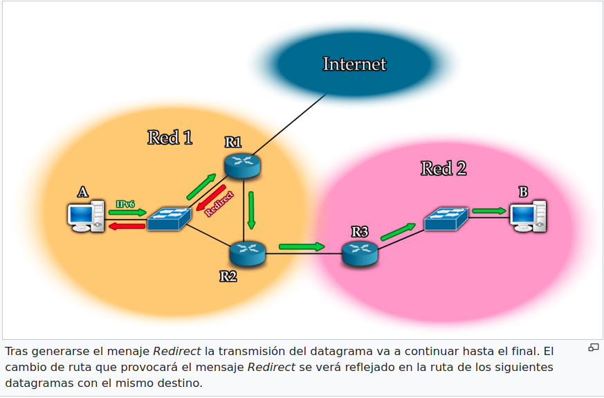

# Neighbord Discover

es un protocolo de IPv6, y es equivalente al protocolo Address Resolution Protocol (ARP) en IPv4, aunque se distingue porque también incorpora funcionalidades de ICMP.

Utiliza mensajes especiales de ICMPv6 construyendo así una manera simple para que los terminales aprendan las direcciones IPv6 de los vecinos de la capa de enlace. Consiste en un mecanismo con el cual un nodo que se acaba de conectar a la red, descubre la presencia de otros nodos en el mismo enlace, además de ver sus direcciones IP. Otra de las grandes funcionalidades de este protocolo es que se ocupa de mantener limpios los cachés dónde se almacena la información relativa al contexto de la red a la que está conectado un nodo. Así, cuando una ruta hacia cierto nodo falla, el router correspondiente buscará rutas alternativas. Basándose también en los mensajes ICMPv6 se permite un mecanismo de auto-configuración. 

# Tipos de enlaces
Existen diferentes tipos de capas de enlaces con diferentes propiedades:

- Con capacidad de multidifusión: es un enlace que soporta enviar paquetes a un subconjuto o a todos los vecinos.
- Punto a punto: es un enlace que conecta dos interfaces. Estos enlaces tienen capacidad de multidifusión y tienen dirección del tipo link-local (unicast).
- Multi-acceso de no difusión (NBMA): es un enlace que soporta más de dos interfaces conectados, pero no tiene capacidad de multidifusión, por lo tanto deberá proveer un mecanismo que le de esta capacidad.
- Medio compartido: es un enlace que permite la comunicación directa entre varios nodos, pero los nodos conectados se configuran de tal manera que no disponen de información de prefijo completa para todos los destinos de enlace. Es decir, en la capa de red, los nodos en el mismo enlace pueden no saber que son vecinos, por lo tanto, se comunicarán a través de un enrutador.
- MTU variable: es un enlace que tiene una MTU definida. Por defecto se comunicará a través de un enrutador.
- Accesibilidad asimétrica: es un enlace dónde se da accesibilidad reflexiva y/o transitiva.
    Reflexiva: Un nodo A alcanza a un nodo B, pero no viceversa.
    Transitiva: Un nodo A alcanza a un nodo B, un nodo B alcanza a un nodo C, pero el nodo A no alcanza al nodo C directamente.

# Tipos de direcciones

En Neighbor Discovery se hace uso de diferentes direcciones de IPv6 todas ellas definidas en RFC4291.

- Multidifusión a todos los nodos: es una dirección del tipo link-local para alcanzar a todos los nodos, y es **FF02::1**.
- Multidifusión a todos los routers: es una dirección del tipo link-local para alcanzar a todos los routers, y es **FF02::2**.
- Link-Local: Es una dirección unicast que sirve para alcanzar a los vecinos, siendo de la forma **FE80::/10**. Cada interfaz de un enrutador debe tener direcciones de este tipo.
- Sin especificar: Es la dirección 0::0 y se suele utilizar no como destino, sino como origen cuando un nodo aún no sabe su propia dirección.

# Mensajes ICMPv6

Un host no puede empezar a utilizar una red hasta que no conoce la identidad de al menos un router local. Estos mensajes proporcionarán un medio por el que un host puede localizar a un router y aprender importantes parámetros relacionados con el funcionamiento de la red local.

Solicitud de router (Router Solicitation): se genera un mensaje de este tipo cada vez que un interfaz de un nodo es activado, para así pedir a los routers que se anuncien (Router Advertisement). 

Nombre del campo | Tamano (bytes) | Descripcion
--- | --- | ---
Type        | 1        | Identifica el tipo de mensaje ICMPv6, para Router Solicitation su valor es 133. 
Code        | 1        | No es utilizado, suele estar a cero. 
Checksum    | 2        | Es calculado de manera similar a la versión IPv4, sirve para proveer detección de errores en la trama. 
Reserved    | 4        | Estos 4 bytes están reservados para usos futuros, están iniciados a cero. 
Options     | variable | En caso de que el nodo que envía este mensaje sabe su dirección de capa 2, debería estar incluida en una opción del                             tipo dirección MAC de origen. 

# Anunciación de router (Router Advertisement): 
es generado automáticamente por los routers al recibir una solicitud de router, o periódicamente para mantener informados a los nodos. 

Nombre del campo | Tamano (bytes) | Descripcion
--- | --- | ---
Type |	1 |	Identifica el tipo de mensaje ICMPv6, para Router Advertisement su valor es 134.
Code |	1 |	No es utilizado, suele estar a cero.
Checksum |	2 |	Es calculado de manera similar a la versión IPv4, sirve para proveer detección de errores en la trama.
Cur Hop Limit |	1 |	El valor de este campo indica a los hosts de la red local el valor que deberán insertar en el campo Hop Limit de los datagramas que envían. Si está a cero está indicando que no se recomienda ningún valor.
Autoconfig Flags |	1 |	Solo se utilizan 2 bits, uno para cada flag. Estos flags permiten al router informar de que manera es la auto-configuración en la red local.
Router Lifetime |	2 |	Indica al receptor de este mensaje cuanto tiempo (en segundos) este router deberá permanecer como router por defecto. Si el valor de este campo es 0, entonces no se deberá utilizar este router por defecto.
Reachable Time 	|4 |	Indica al host cuanto tiempo (en mili-segundos) deberá considerar un vecino como alcanzable después de recibir la confirmación de alcanzable.
Retrans Timer |	4 	|Indica el tiempo (en mili-segundos) que el host debe esperar antes de retransmitir.
Options |	variable |	Hay tres tipos de información que este campo puede contener.

# Solicitud de vecino (Neighbor Solicitation): 
son utilizadas por los nodos para determinar la dirección MAC de un vecino, o para verificar que un vecino sigue siendo accesible a través de una dirección MAC que se encuentra en caché. También es utilizado para detectar direcciones IP duplicadas.

Nombre del campo | Tamano (bytes) | Descripcion
---    | --- | ---
Type      |	1|	Identifica el tipo de mensaje ICMPv6, para Neighbor Solicitation su valor es 135.
Code      |	1 |	No es utilizado, suele estar a cero.
Checksum  |	2 |	Es calculado de manera similar a la versión IPv4, sirve para proveer detección de errores en la trama.
Reserved  |	4 |	Estos 4 bytes están reservados para usos futuros, están iniciados a cero.
Target Address |	16 |	Contendrá la dirección IP unicast del dispositivo del cual se está intentando resolver su dirección MAC.
Options |	variable |	Si el dispositivo que genera la solicitud sabe su propia dirección IP y MAC, se deberá incluir en las opciones la dirección IP y MAC de origen. Esto se hace con el propósito de que el receptor añada a su caché estas direcciones.

# Anunciación de vecino (Neighbor Advertisement): 
Se genera automáticamente al recibir una solicitud de vecino, o se genera cuando se va a realizar un cambio en la dirección MAC (reemplazar el host por otro). 

Nombre del campo | Tamano (bytes) | Descripcion
---    | --- | ---
Type |	1 |	Identifica el tipo de mensaje ICMPv6, para Neighbor Advertisement su valor es 136.
Code |	1 |	No es utilizado, suele estar a cero.
Checksum | 	2 |	Es calculado de manera similar a la versión IPv4, sirve para proveer detección de errores en la trama.
Flags |	4 |	Solo se utilizan 3 bits, uno para cada flag. Estos flags permiten transmitir información sobre el mensaje:**Bit 1 (R)**: Identifica el tipo de dispositivo que ha enviado el mensaje (1 cuando el mensaje lo ha enviado un router, y 0 cuando ha sido enviado por un host). También se utiliza para detectar cuando un router cambia de funcionar como tal, a funcionar como un host.**Bit 2 (S)**: Cuando está a 1 indica que el mensaje ha sido enviado en respuesta a un Neighbor Solicitation.**Bit 3** (O): Cuando está a 1 indica al receptor que deberá sobrescribir cualquier información de caché relacionada con la dirección de dispositivo origen.Resto (Reserved): Bits reservados para uso futuro.
Target Address |	16 |	Si el mensaje es enviado en respuesta a un Neighbor Solicitation entonces este campo tendrá el mismo valor que el campo target address del mensaje Neighbor Solicitation. Comúnmente contendrá la dirección IP de dispositivo que genera este mensaje.
Options 	|variable |	Cuando este mensaje es generado en respuesta a un Neighbor Solicitation multicast entonces será obligatorio que se añada la dirección MAC del dispositivo que genera este mensaje. En cambio, cuando la respuesta se debe a un Neighbor Solicitation unicast no será obligatorio incluir la dirección MAC (ya que para enviar Neighbor Solicitation necesitaba la dirección MAC, es decir, ya la tiene), pero se suele incluir. 

# Redirección (Redirect): 
se genera cuando un nodo quiere informar a un router de una mejor ruta hacia un destino. Estos mensajes siempre son unicast. 

Nombre del campo | Tamano (bytes) | Descripcion
---    | --- | ---
Type |	1 |	Identifica el tipo de mensaje ICMPv6, para Redirect su valor es 137.
Code |	1 |	No es utilizado, suele estar a cero.
Checksum |	2 |	Es calculado de manera similar a la versión IPv4, sirve para proveer detección de errores en la trama.
Reserved |	4 |	Estos 4 bytes están reservados para usos futuros, están iniciados a cero.
Target Address |	16 |	Contiene la dirección IP del router por el cual la ruta hacia el destino hubiera sido más eficiente.
Destination Address |	16 |	Contiene la dirección IP del destino al que iba dirigido el paquete, antes de que se generase el mensaje Redirect.
Options 	|variable |	Normalmente se utilizan dos tipos de opciones: 1. Dirección MAC de origen: Contiene la dirección MAC del dispositivo generador de este mensaje. Con esto se evita tener que realizar la resolución de dirección MAC una vez el router de destino reciba este mensaje. 2. Cabecera redirigida (Redirected Header): Para hacer que este mensaje supere la unidad máxima de transferencia (MTU), es decir 1280 bytes, se introducirá parte del datagrama que originó este mensaje. Se cogerá tanto como sea necesario hasta llegar a 1280 bytes.

# Funcionalidades de descubrimiento Host-Router

Este es uno de los principales grupos de funcionalidades de Neighbor Discovery ya que facilitan el descubrimiento de routers locales e intercambian información entre ellos y los hosts. Estas funcionalidades se distinguen en cuatro específicas y están diseñadas para su uso en los mensajes Router Solicitation y Router Advertisement:

- Router Discovery (Descubrimiento de Router): es el método por el cual los hosts localizan routers en la red local.
- Prefix Discovery (Descubrimiento de Prefijo): los hosts utilizan esta función para determinar en qué red se encuentran. A su vez esta función indica como diferenciar entre destinos locales o distantes a la red local y si intentar la entrega directa o indirecta de datagramas.
- Parameter Discovery (Descubrimiento de Parámetros): es el método por el cual un host aprende parámetros importantes sobre la red local y/o routers, como por ejemplo la MTU del enlace local.
- Address Autoconfiguration (Auto-configuración de dirección): los hosts en IPv6 son capaces de configurarse automáticamente, pero esto requiere información que es proporcionada por un router.

Para proporcionar todas estas funcionalidades es necesario que los routers y los hosts realicen una serie de tareas: 

# Tareas realizadas por los routers

.|Tareas Realizadas |. 
---    | --- | ---
Routine Advertisement (Rutina de Anunciación) |	La principal tarea que tienen los routers en Neighbor Discovery es la de enviar periódicamente menajes de Router Advertisement. Cada router posee un contador que controla cada cuanto tiempo un anunciación de este tipo es enviado. Los mensajes de Router Advertisement también son enviados en situaciones espaciales como por ejemplo cuando cambia información clave sobre el router como podría ser su dirección en la red local.
Parameter Maintenance (Mantenimeitno de Parámetros)| 	Los routers son responsables del mantenimiento de los parámetros clave de la red local así que estos parámetros serán enviados en los mensajes de anunciación. Estos parámetros son el campo Hop Limit de los datagramas IP que enviarán los hosts de la red, un valor de MTU para la red, e información como los prefijos de red es utilizada para el primer salto en la ruta y para auto-configuración.
Solicitation Processing (Procesado de Solicitaciones) | 	Los routers siempre están pendientes de recibir Router Solicitation, y cuando se recibe uno de estos mensajes, inmediatamente el router responderá con un Router Advertisement al host.

# Tareas realizadas por los hosts
.|Tareas Realizadas |. 
---    | --- | ---
Advertisement Processing (Procesado de Anunciaciones) |	Los hosts siempre están a la escucha de mensajes de anunciación y los procesan. En estos mensajes de anunciación se incluyen estructuras de datos como listas de prefijos y routers, que serán actualizados con la llegada de cada nuevo mensaje de anunciación.
Solicitation Generation (Generación de Solicitudes)| 	Bajo ciertas condiciones, un host generará un mensaje Router Solicitation y se enviará a la red local. Es un mensaje muy simple ya que solo requiere que le llegue a cualquier router local. Cuando le llega al router, este inmediatamente enviará un Router Advertisement de vuelta al host que originó la solicitud. Estas solicitudes cuando más se suelen realizar es cuando un host es iniciado por primera vez, por lo tanto, si se generá una solicitud el host no tendrá que esperar al siguiente Router Advertisement generado periódicamente.
Autoconfiguration (Auto-Configuración) |	En caso de que se requiera y de que la red lo soporte, el host utilizará información proporcionada por el router local para configurarse automáticamente con una dirección IPv6 y con otros parámetros. 

# Funcionalidades de descubrimiento Host-Host

Este es otro de los principales grupos de funcionalidades de Neighbor Discovery está asociado con información determinante y la comunicación entre nodos (normalmente hosts).Algunas de las siguientes funciones también puede ser utilizada entre un router y un host, pero este grupo no fue específicamente diseñado para ello. Estas funcionalidades se distinguen en cuatro específicas:

- Address Resolution (Resolución de dirección): es el proceso por el cual un dispositivo obtiene la dirección de capa 2 (MAC) de otro dispositivo de la red local a partir de su dirección de capa 3 (IPv6)
- Next-Hop Determination (Determinación del siguiente salto): es el método por el cual se consulta el destino del datagrama IP y así se determina dónde se debe enviar a continuación.
- Neighbor Unreachability Detection (Detección de vecino inalcanzable): es el proceso que determina si un vecino puede ser o no contactado.
- Duplicate Address Detection (Detección de direcciones duplicadas): determina si la dirección que un dispositivo desea utilizar ya existe en la red.

## El envío de datagramas IP puede ser dividido en dos métodos:

- Envío indirecto: requiere que los routers presten ayuda a los hosts a través de las funcionalidades **Host-Router**.
- Envío directo: el envío es desde un host a otro host en la misma red. No requiere el uso de routers, pero necesitará funciones que involucren la determinación del siguiente salto comunicado directamente entre hosts.

### Para proporcionar todas estas funcionalidades es necesario que los hosts realicen una serie de tareas: 

.|Tareas Realizadas | 
---    | --- | ---
Next-Hop Determination (Determinación del siguiente salto)|La primera tarea que todo host debe realizar al enviar un datagrama es determinar el siguiente salto. Este es un proceso por el cual un dispositivo mira la dirección de destino de un datagrama y decide si realizar un envío directo o indirecto. Esto se hace observando la información de prefijo obtenida de los routers locales y comparando la dirección de destino del datagrama con el prefijo se va a daterminar si el dispositivo de destino está en la red local o en una red distante. Si es el destino está en la red local, entonces el siguiente salto será a la misma dirección de destino, en cambio, si el destino no está en la red local, entonces el siguiente salto es elegido de la lista de routers locales (está lista estará configurada manualmente o a través de las funcionalidades de Host-Router de Neighbor Discovery).Por propósitos de eficiencia, los hosts no la determinación del siguiente salto para cada datagrama. Tienen una caché de destinos que contiene información sobre los siguientes saltos a los datagramas enviados recientemente. Cada vez que se realiza una determinación de siguiente salto se va a almacenar en esta caché, para que así está información se pueda utilizar para los futuros datagramas que serán enviados a ese dispositivo.
Address Resolution (Resolución de dirección) |	Si un host llega a la conclusión de que el destino de un datagrama es en la red local, se necesitará enviar dicho datagrama al dispositivo de destino. Para realizar la transmisión se necesitará saber la dirección de capa 2 (MAC) del destino. El hecho de conseguir la dirección MAC de destino a partir de la dirección de capa 3 (IPv6) se denomina resolución de dirección.Para realizar este proceso de resolución el dispositivo que desea saber la MAC del destino debe enviar un mensaje Neighbor Solicitation con la dirección IP de destino. El destino responderá con un mensaje Neighbor Advertisement que contendrá su dirección MAC. Esta resolución de direcciones puede ser utilizada para hallar la dirección MAC de un host o de un router.
Updating Neighbors Using Neighbor Advertisement Messages (Actualizar los vecinos) |	Los mensajes de Neighbor Advertisement no son enviados periódicamente como los de Router Advertisement. Esto no es ninguna necesidad ya que los vecinos no cambian mucho con el paso del tiempo, y de esta manera las resoluciones ocurrirán de manera natural cada vez que los dispositivos se envíen datagramas entre sí. Además, sería poco eficiente para la red que se enviasen periódicamente anunciaciones por cada host.De cualquier manera, un host puede enviar un mensaje Neighbor Advertisement no solicitado cuando ve necesario actualizar la información de los vecinos en la red local. Por ejemplo cuando se reemplaza la tarjeta de red de un equipo (cambiará su dirección MAC), se podrá enviar un mensaje Neighbor Advertisement para que los vecinos actualicen la dirección MAC en su caché.
Neighbor Unreachability Detection and the Neighbor Cache (Detección de vecinos inalcanzables y la caché de los vecinos)| Los mensajes Neighbor Solicitation y Neighbor Advertisement a menudo son asociados solamente con a la resolución de direcciones, pero tienen otros propósitos también. Uno de estos propósitos es la detección de vecinos inalcanzables. Cada dispositivo tiene información sobre sus vecinos y la actualiza dinámicamente según las condiciones de la red van cambiando. Esta información es guardada ya sea para un host o para un router de la red.El hecho de saber cuando un dispositivo ya no es alcanzable es importante ya que un host deberá adaptar su comportamiento de acuerdo a esto. En caso de un host inalcanzable, el dispositivo debería esperar cierto periodo de tiempo antes de intentar enviar datagramas al host inalcanzable, evitando así inundar la red con repetidos intentos de envío. En cambio, el que un router sea inalcanzable indica que el dispositivo tiene que buscar un nuevo router para utilizar (si existe alguna alternativa).Cada host tiene una caché de vecinos dónde guarda información sobre los dispositivos vecinos. Cada vez que un host recibe un datagrama de un vecino, sabrá que el vecino es alcanzable en ese momento, creándose así una entrada en la caché para indicarlo. Claro que cuanto más tiempo pase desde que se ha recibido un datagrama de un vecino, mayor es la posibilidad de que algo ocurrido para que el vecino ya no sea alcanzable. Por esta razón la información de caché debe ser considerada temporal. Cada vez que un vecino es anotado en la caché como alcanzable, se inicia un contador. Cuando el tiempo termina, la alcanzabilidad de cierto vecino es considerada antigua, y por lo tanto no se asume que el vecino siga estando disponible. Cuando se recibe de nuevo un datagrama del vecino cuya información ha caducado, el contador es reiniciado indicando así que el vecino es alcanzable de nuevo. El tiempo que un vecino debería ser considerado alcanzable es comunicado en los mensajes Router Advertisement. Es posible que un host necesite saber si un vecino sigue estando alcanzable, para esto se mandará un Neighbor Solicitation esperando un Neighbor Advertisement actualizándose la información en la caché..
Duplicate Address Detection (Detección de direcciones duplicadas)| 	Cuando un host utiliza el proceso automático de configuración IPv6 uno de los pasos a realizar es asegurarse de que la dirección que se a a utilizar ya existe en la red. Esto se hace enviando un mensaje Neighbor Solicitation a la dirección que se pretende comprobar. SI se recibe un mensaje Neighbor Advertisement eso significa que la dirección ya se está usando. 

# Funcionalidad de redirección

Una de las mayores responsabilidades de Neighbor Discovery es la de la función de redirección. Es utilizada por un router para informar a un host de una mejor ruta para enviar los datagramas a un destino concreto.

Los routers son responsables de detectar situaciones en las cuales un host de la red local ha tomado una decisión ineficaz de encaminamiento para el primer salto, y debe actuar para corregir esto. Por ejemplo, considérese una red que está formada por dos routers, R1 y R2. Un host A quiere enviar un datagrama al dispositivo B de otra red que está conectada a A a través del router R2. Si A envía un datagrama a R1, R1 sabrá que tiene que pasar por R2, y por lo tanto se lo enviará. Viendo que R2 también estaba en la red local, R1 se da cuenta de que A ha tomado una mala decisión ya que el datagrama tenía que haber sido enviado directamente al router R2, no a R1. Como respuesta, R1 creará un mensaje Redirect. Este mensaje le indicará a A que cualquier datagrama con ese destino deberá ser enviado a través de R2.

Solamente los routers enviarán mensajes Redirect. Los hosts son responsables de esperar estos mensajes, y cuando les lleguen procesarlos. Cuando un host procesa la información de un mensaje Redirect actualizará su caché de acuerdo a esto.

