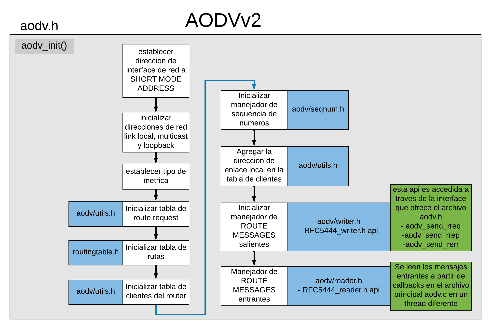

# IMPLEMENTACION PROTOCOLO AODV-V2


Figura 1

En la figura 1 podemos observar que el punto de entrada del modulo aodvV2 es la funcion aodv_init(), representada con el recuadro gris.
Esta funcion es la encargada de iniciar todo el proceso de ruteo AODV2, y quedar a la espera de mensajes entrantes provenientes de otros nodos, o en su defecto esperando a que el usuario decida enviar informacion.


## Proceso de inicializacion

Conociendo el origen de inicio del modulo, podemos observar los siguientes procesos antes de que el nodo este listo para enviar y recibir mensajes:

- Configurar la direccion de la interface de red a ```SHORT-MODE```
- Configurar direcciones de red
  - Link-local
  - multicast
  - loopback
  
- configurar tipo de metrica. Esta configuracion permite calcular el costo o calidad de una ruta.
  
-  Inicializar tabla de route request. Esta tabla almacena rutas que aun no han sido comprobadas como bidireccionales.
  
-  Inicializar tabla de rutas. Esta tabla es utilizada para almacenar rutas provenientes de los RREP.
  
-  INicializar tabla de clientes del route. Esta tabla permite almacenar la informacion de los clientes del mismo router.
  
-  Inicializar manejador de secuencia de numeros. esta utilidad permite hacer el manejo de la secuencia, tales como: Init, Get, y cmp(comparar).
  
-  Agregar la direccion local a la tabla de clientes. cada nodo es un cliente de si mismo.
  
-  Inicializar manejador de ```ROUTE MESSAGES``` salientes  **aodv/writer.h**
   -  Esta api es accedida a traves de las funciones que ofrece aodv.h dentro de ```net/include*aodvv2/aodv.h``` y permite enviar cualquier tipo de mensaje tipo ```ROUTE MESSAGE```. Internamente implemennta la API ```rfc5444_writer, para enviar mensajes con formato hacia otros nodos, haciendo uso de un socket udp tipo datagrama para enviar los paquetes.
  

- Inicializar el manejador de ```ROUTE MESSAGES``` entrantes. **aodv/reader.h**
  - Esta api permite registrar funciones de callback que se ejecutan en el momento que se obtienen mensajes de tipo **ROUTE MESSAGE**, para que puedan ser procesados dentro del mismo modulo aodv, sin necesdidad de acceder a las funciones de RFC5444 directamente.
  - Cualquier mensaje entrante de tipo **route message** sera procesado dentro del file aodv.c, para determinar el tipo de mennsaje y determinar que hacer con el. 

   
